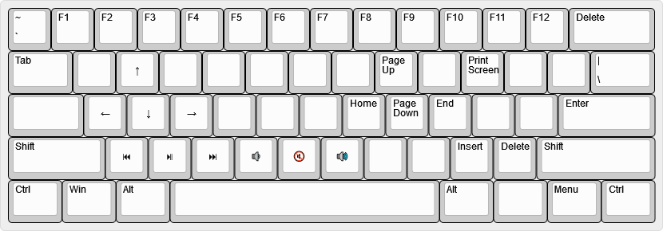

# Custom Keymap for BT60 Hotswap

This is a customized (and bugfixed) version for the BT60 Hotswap.

## Base Layer

## Advanced Layer

## Functions Layer

## Customisation

In order to change the keymap to meet your needs, you will need a GitHub account. Click the "fork" button in the top right to create your own version of the repo, then use the drop down menu to select the branch with your layout. The keymap information is contained entirely within the file bt60.keymap. Download this file to your computer and open it in a text editor such as Atom or notepad++ then you can open and edit it. The full list of ZMK keycodes can be found here. After editing the keymap file upload it to the original folder using the "Add file" dialog in GitHub, then click on "Actions" and wait for the build process to complete (The orange dot will go to either a red X or green tick).

In the tag v.1.1.0 you will find the bugfixed stock version of the original firmware.

## Compilation and downloading

If you have made any errors in the keymap the compilation will fail and there will be a red X in the actions dialog. Click on it and it will tell you where the problem is. If the build completes with no errors you will be able to find the firmware in the "Artifacts" section of the last action. Put the keyboard into bootloader (Either double tap the hardware reset button or use FN + R) and drag and drop the .uf2 file onto the usb drive that shows up